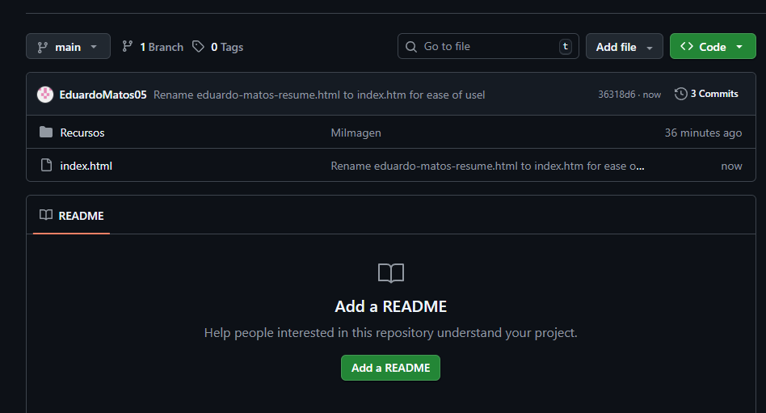
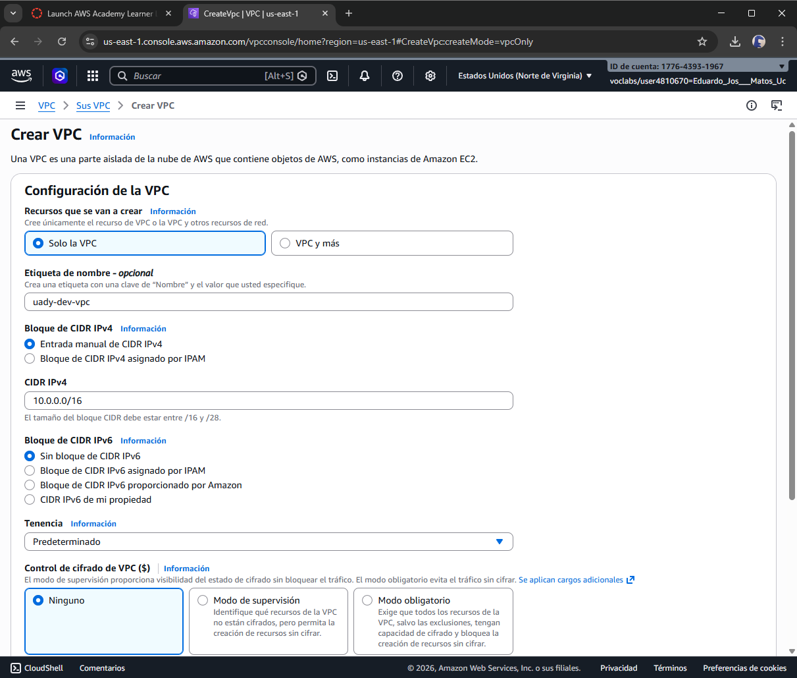
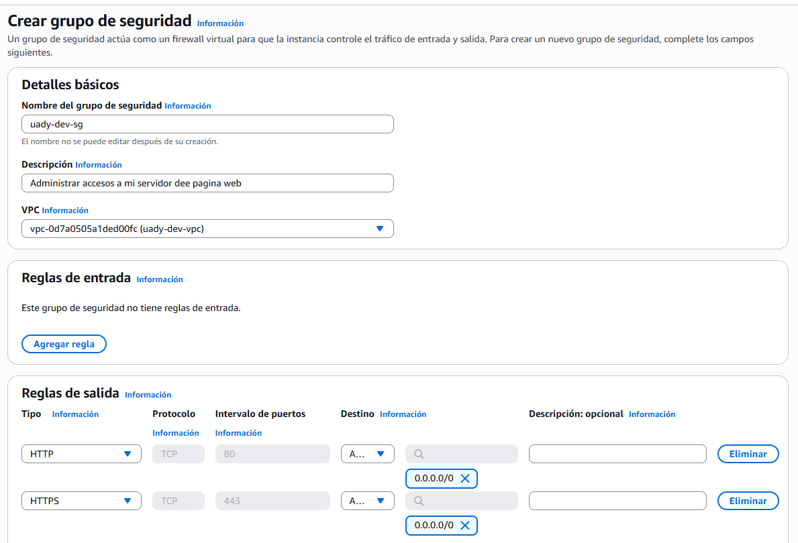
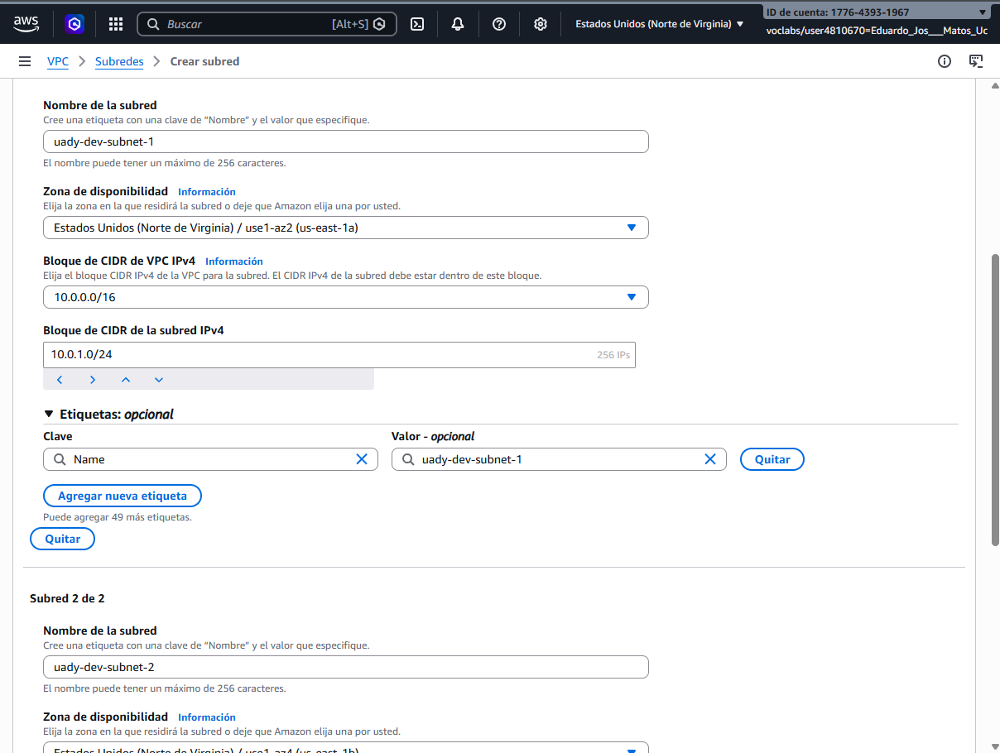

#  CV Web Personal — Desplegado en AWS EC2

> Proyecto personal en desarrollo continuo. Actualmente hosteado en una instancia EC2 con Nginx. El siguiente paso es migrarlo a **Amazon S3** para un hosting estático más eficiente, y a futuro obtener un **dominio propio** para tener una URL profesional donde presentar mi CV.

---

## Descripción

Sitio web personal en formato CV, desarrollado como un **único archivo HTML estático** (sin backend, sin framework, sin dependencias de servidor) y desplegado en infraestructura de AWS. El proyecto cubre desde la creación de la página hasta su publicación en la nube, pasando por la configuración de red, seguridad y servidor web.

Al ser un sitio 100% estático — un solo archivo HTML con CSS y JS embebidos — no requiere cómputo activo para funcionar. Esto lo hace ideal para migrar a **Amazon S3**, donde los archivos se sirven directamente desde almacenamiento de objetos sin necesidad de una instancia EC2 corriendo 24/7. El costo de S3 para un sitio de este tamaño es prácticamente cero comparado con mantener un servidor encendido.

Aún estoy aprendiendo sobre servicios cloud y este proyecto refleja ese proceso: cada paso fue una oportunidad para entender mejor cómo funciona AWS en la práctica.

---

##  Pasos del despliegue

### 1. Creación de la página web

Se desarrolló el CV en formato web usando HTML5 y CSS como base, incorporando datos personales, información académica y proyectos. Una vez terminado, se verificó su funcionamiento local antes de publicarlo.


---

### 2. Publicación en GitHub

El proyecto se subió a este repositorio para almacenar el código en la nube y facilitar su clonación automática desde el servidor EC2 durante el arranque.



---

### 3. Creación de la VPC

Se configuró la infraestructura de red en AWS. Inicialmente se intentó crear la VPC de forma manual configurando subnets, Internet Gateway y tablas de ruteo individualmente. Posteriormente se utilizó el wizard **"VPC and more"** que automatiza todos esos componentes correctamente.



---

### 4. Configuración del Security Group

Se creó un Security Group para controlar el tráfico de entrada a la instancia. Solo se habilitaron los puertos necesarios:

- **HTTP** — puerto 80
- **HTTPS** — puerto 443

No se habilitó SSH (puerto 22) ya que toda la configuración del servidor se realizaría automáticamente mediante un script en User Data.



---

### 5. Lanzamiento de la instancia EC2

Se lanzó una instancia **t3.micro** con Amazon Linux 2023 dentro de una subnet pública de la VPC. Durante la configuración se asignó la IP pública y se adjuntó el Security Group creado anteriormente.

En la sección **User Data** se añadió un script de arranque que:

1. Instala Nginx
2. Inicia el servicio automáticamente
3. Clona el repositorio desde GitHub
4. Copia los archivos al directorio raíz del servidor web (`/usr/share/nginx/html`)

```bash
#!/bin/bash
dnf update -y
dnf install -y nginx git

systemctl enable nginx
systemctl start nginx

cd /usr/share/nginx/html
rm -rf *

git clone https://github.com/EduardoMatos05/AWS-WebApp-CV.git temp
cp -r temp/* .
rm -rf temp
```



---

### 6. Acceso y verificación

Una vez que la instancia pasó a estado **running** y superó las verificaciones de estado, se accedió al sitio usando el DNS público de AWS vía HTTP/HTTPS. La página cargó correctamente, confirmando el despliegue exitoso.


---

##  Stack / Tecnologías

| Capa | Tecnología |
|---|---|
| Frontend | HTML5, CSS3 |
| Servidor web | Nginx |
| Infraestructura | AWS EC2 (t3.micro) |
| Red | AWS VPC, Subnets, Internet Gateway |
| Seguridad | AWS Security Groups |
| CI básico | GitHub (clonación en arranque) |

---

## 🔮 Próximos pasos

- [ ] **Migrar a Amazon S3** — hosting estático más simple, económico y escalable
- [ ] **Configurar dominio propio** — obtener un dominio y apuntarlo al bucket S3 o a una distribución CloudFront
- [ ] **CloudFront + HTTPS** — CDN y certificado SSL con AWS Certificate Manager
- [ ] **CI/CD real** — automatizar el despliegue con GitHub Actions al hacer push

---
